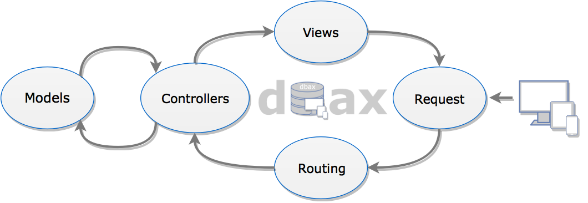
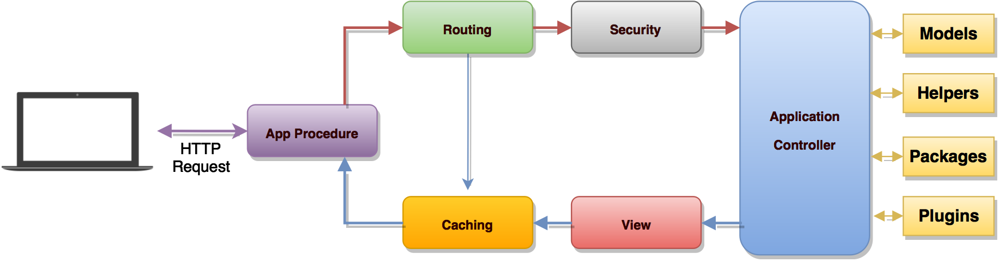
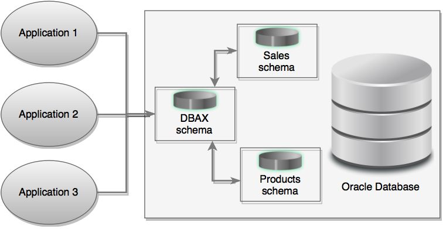
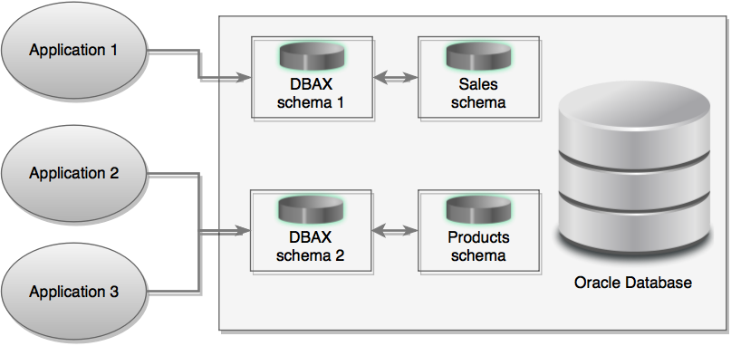

# dbax Database Application eXpress

## Bienvenido a dbax

__dbax__ (Data Base Application eXpress) es un Framework Open Source para el desarrollo MVC de aplicaciones Web con PL/SQL para aplicaciones de base de datos de alto rendimiento. Usando tan solo un navegador Web y una herramienta SQL como puede ser SQL Developer o Toad, podrá desarrollar y desplegar aplicaciones Web profesionales para cualquier dispositivo (ordenadores personales, móviles, tablets..)

__dbax__ es soportado por la comunidad y puede ser instalado en cualquier edición de la Base de Datos Oracle (incluido XE). __dbax__ corre dentro de la Base de datos Oracle lo que permite que su aplicación escale con facilidad y pueda satisfacer a las cada vez mayores comunidades de usaurios.

## ¿Por qúe dbax?

Normalmente se necesita de base de datos cuando se desarrolla una aplicación Web. En mi dia a día trabajo con bases de datos Oracle y creo que el mejor lugar para implementar la lógica de negocio de nuestras aplicaicones es dentro de la propia base de datos, ya sea en paquetes PL/SQL, triggers o constraints.

En un entorno empresiaral, Java suele ser el lenguaje mas utilizado y para obtener un bien rendimiento combinamos Java + PL/SQL en el desarrollo de aplicaicones Web. Pero con Java los tiempos de desarrollo suelen ser excesivamente altos si los comparamos, por ejemplo, con PHP. Además  necesitamos de diferentes perfiles de desarrolladores, desarrolladores SQL+PL/SQL y desarrolladores Java+HTML+CSS... incrementando los recursos necesarios para el proyecto.

Oracle ya intenta solucionar estos problemas con Oracle Apex, que si bien un desarrollador PL/SQL puede obtener fantasticos resultados, Apex proponen un desarrollo declarativo que es dificil de gestionar con un control de versiones y donde el desarrollador acabºa aprendiendo más sobre el propio framework que sobre la tecnologia que lo sustenta.

__dbax__ resuelve estos problemas, proponiendo un modelo de desarrollo similar a PHP (rápido y flexible) con un patrón MVC y enfocado en la productividad de los desarrolladores. Todo el desarrollo se realiza dentro de la base de datos  mediante SQL+PL/SQL+HTML+CSS... y puede usar todas las tecnologias web que necesite ya que __dbax__ no lo restringe, HTML5, CSS3, JS (cualquier libreria Angular, React...), Web Components... y lo que pueda venir.

Con __dbax__ los desarrolladores PL/SQL aprenden de tecnologias Web y estos conocimientos y conceptos adquiridos son similares en otros entornos web (PHP, Java, .Net MVC, nodeJS).

En la sección de [ejemplos](examples), podrá encontrar unos cuantos ejemplos de __dbax__.


### Otros problemas que soliciona dbax

|Problema de desarrollo | Solución __dbax__ |
|--| --|
| Necesito bajar el coste de desarrollo.| Tiempos de desarrollo rápidos junto a una adopción rápida de los desarrlladores da como resultado un menor coste y una puesta en producción temprana de su producto. |
| Necesito reducir al mínimo el costo de Licencias con Oracle.| __dbax__ es Open Source y compatible con todas las ediciones de la base de datos Oracle y se puede desplegar junto a servidores Web Open Source como Tomcat o Galssfish. |
| Oracle Forms ya no es nuestra herramienta estratégica de desarrollo y  necesito una alternativa. | __dbax__ debe ser la principal herramienta de desarrollo para cualquier desarrollador de Oracle con experiencia PL/SQL, ya que les permite desarrollar aplicaciones Web aprovechando sus conocimientos. |
| Tengo que sustituir Oracle Discoverer por otra herramienta mas moderna. | __dbax__ es una solución ideal a Discoverer, ya sea para generar sencillos reports o completos cuadros de mando. |
| ¿Cómo puedo desarrollar aplicaciones móviles sin ADF? | __dbax__ está listo para desarrollar aplicaciones móviles con tecnología que desee. |
| Las hojas de cálculo (como Excel) se está apoderando de mi departamento y necesito una alternativa .| __dbax__ es una gran solución para consolidar hojas de cálculo, mejorar la calidad y seguridad de los datos, reducir la duplicación y la administración y mejorar su funcionalidad.


## Descripción de la Arquitectura

__dbax__ utiliza una arquitectura sencilla donde las paginas web son generadas dinámicamente usando el  motor de plantillas [tePLSQL](https://github.com/osalvador/tePLSQL) y el patrón MVC. Los Controladores y los Modelos son paquetes PL/SQL compilados en un esquema diferente al de __dbax__. Una vez instalado y configurado completamente, se define una URL para acceder a la consola de __dbax__. Los desarrolladores solo necesitan de un Navegador Web y un cliente SQL (SQL Developer, Toad...) para crear, desarrollar y desplegar aplicaciones __dbax__

Los componentes de __dbax__ son almacenados en tablas de metadatos, a excepción de los controladores y los modelos, que contienen la definición de la aplicación. Cuando un desarrollador crea, modifica, o elimina cualquier compoente los cambios serán visibles de immediato. La consola de __dbax__ permite a los desarrolladores moverse rápidamente entre el entorno de desarrollo para realizar las mejoras adicionales que sean requeridas. La capacidad de iterar rápidamente una aplicación, aumenta enormemente la productividad de los desarrolladores.

Instancia única. Perfecta para una infraestructa cloud VPS o un entorno de desarrollo.
<p align="center">
  
</p>

Miltiples instanacias. Ideal para una arquitectura empresarial con múltiples instancias de base de datos Oracle, Oracle RAC o Exadata.
<p align="center">
  
</p>

La arquitectura de __dbax__ requiere de algún servidor web o proxy, que redireccione las peticiones entre el navegador web del usuario y el motor de __dbax__. Los servidores Web disponibles son:

- Oracle REST Data Services: Oracle REST Data Services (ORDS) es una solución basada en Java, una herramienta gratuita que corre en un contenedor JEE como puede ser Apache Tomcat, Glassfis o Oracle Weblogic Server.
- Embedded PL/SQL Gateway: The Embedded PL/SQL Gateway (EPG) corre sobre Oracle XML DB Protocol Server que está internamente en la Base de Datos Oracle e incluye todas las características que tiene mod_plsql
- Oracle HTTP Server: Oracle HTTP Server (Apache) con el plugin mod_plsql puede ser instalado en la misma máquina fisica con la Base de datos o en una maquina separada. Nota: mod_plsq está obsoleto desde la versión 12c de Oracle. Se recomienda usar Oracle REST Data Services en su lugar.

## A simple vista

### dbax es un Framework de Aplicaciones

__dbax__ es un potente framework de desarrollo de aplicaciones, un conjunto de herramientas (toolkit) para construir aplicaciones web usando SQL y PL/SQL en las bases de datos Oracle.

Su objetivo es permitir el desarrollo de proyectos mucho más rápido de lo que lo haría si estuviera escribiendo el código desde cero, proporcionando un conjunto de librerías (APIs) para las tareas comunes, así como una interfaz simple. __dbax__ le permite centrarse en su proyecto, reduciendo al mínimo la cantidad de código necesaria para una desarrollar una tarea.

### dbax es libre

__dbax__ está disponible bajo la licencia LGPL para que puedas usarlo como quieras. Para obtener más información, puede leer el [acurdo de licencia](https://github.com/osalvador/__dbax__/blob/master/LICENSE).

### dbax es ligero

Verdaderamente ligero. El núcleo del sistema requiere sólo unas pocas librerias muy pequeñas. Al contrario que con muchos frameworks que requieren muchos más recursos. Con PL/SQL las librerias se cargan de forma dinámica a petición, por lo que el sistema de base es muy delgado y bastante rápido.

###dbax es rápido

Realmente rápido. Le retamos a encontrar un framework MVC PL/SQL que tenga mejor rendimiento que __dbax__.

###dbax usa M-V-C

__dbax__ utiliza el enfoque de Modelo-Vista-Controlador, que permite una correcta  separación entre la lógica y la presentación. Esto es particularmente bueno para los proyectos en los que los diseñadores están trabajando con los archivos de plantilla (front-end), ya que se reducirá al mínimo el código de que estos archivos contienen. MVC se describe con más detalle en su propia página.



###dbax Genera URLs limpias

Las URLs generadas por __dbax__ son limpias y amigables para los motores de búsqueda. En lugar de utilizar el método estándar "query string" que usan los sistemas dinámicos, __dbax__ utiliza un enfoque basado en segmentos:

<pre class="prettyprint ">
example.com/noticias/articulo/345
</pre>

Por defecto, el `dad_name` y el `appid`  estan incluidos en la URL pero puede ser eliminado mediante una reescritura de urls de Apache o Nginx.
Esto se explicará más adelante.

###__dbax__ incopora un Motor de Plantillas

Un motor de plantillas es necesario para mantener una iteraccion con las vistas HTML, por tanto __dbax__ incorpora un sencillo motor de plantillas basado en  [tePLSQL](https://github.com/osalvador/tePLSQL) el cual tiene la misma sintaxis que [Oracle PSP](https://docs.oracle.com/cd/E11882_01/appdev.112/e41502/adfns_psp.htm#ADFNS016) y [Java JSP](http://www.java2s.com/Tutorials/Java/JSP/0020__JSP_Syntax.htm):

``` html
<!-- Consulta todos los usuarios de la BD-->
<ul>
    <% for c1 in (select username from all_users) loop %>
        <li> <%= c1.username %> </li>
    <% end loop; %>
</ul>
```

Generará el siguiente código:

``` html
<ul>
 <li>XS$NULL</li><li>HR</li><li>MDSYS</li><li>ANONYMOUS</li><li>XDB</li><li>CTXSYS</li><li>OUTLN</li><li>SYSTEM</li><li>SYS</li><li>DBAX</li>
</ul>
```

Que se visualiza así:

<pre class="prettyprint">
<ul><li>XS$NULL</li><li>HR</li><li>MDSYS</li><li>ANONYMOUS</li><li>XDB</li><li>CTXSYS</li><li>OUTLN</li><li>SYSTEM</li><li>SYS</li><li>DBAX</li></ul>
</pre>

De este modo, usted no tiene que aprender un nuevo lenguaje de plantillas. Además los archivos PSP que tenga, serán compatibles con __dbax__ sin tener que modificarlos.


## Diagrama de flujo de las aplicaciones dbax

El siguiente gráfico ilustra cómo es el flujo de datos el sistema:



 1. El servidor web elegido manda la petición del usuario a un procedimiento que tiene el APPID como nombre. Éste invoca a DBAX_CORE que hace de controlador frontal e inicializa de los recursos básicos necesarios para ejecutar __dbax__.
 2. El enrutador examina la petición HTTP para determinar qué se debe hacer con ella.
 3. Si existe un archivo de caché, se envía directamente al navegador, sin pasar por la ejecución normal del sistema.
 4. Seguridad. Antes de que se cargue el controlador de la aplicación, la petición HTTP y todos los datos enviados por los usuarios se analizan por seguridad.
 5. El controlador carga el modelo, revisa la autorización, recupera los parámetros del usuario, y todos los demás recursos necesarios para procesar la solicitud.
 6. La vista final se prestan, entonces se envía al navegador web para ser visualizada. Si se habilita el almacenamiento en caché, la vista se almacena en la caché primero, para que en las solicitudes posteriores se puede servir directamente desde la caché.

## Model-Vista-Controlador

__dbax__ se basa en el patrón de desarrollo del Modelo-Vista-Controlador. MVC es un enfoque de software que separa la lógica de aplicación de la presentación. En la práctica, permite que las vistas solo tengan código de presentación y que la logica de negocio se produzca en los modelos y controladores.


**El modelo** representa las estructuras de datos. Normalmente los precedimientos y funciones del modelo contendrán las operaciones que le ayudan a recuperar, insertar y actualizar la información en su modelo de datos. Por lo tanto, el modelo representa la lógica de negocio del sistema, independiente de la forma de interacción que tenga.

**La vista** es la información que se presenta a un usuario. La vista la componen todos los elementos que son presentados al usuario: páginas, formularios, mensajes, etcétera. Una vista normalmente será una página web, pero en DBAX, una vista también puede ser un fragmento de la página como un encabezado o pie de página.

**El controlador** contiene la lógica que coordina el resto de componentes. Indica como responder a cada acción del usuario, como utilizar el modelo, etcétera. Por lo tanto, el controlador actúa como un intermediario entre el Modelo, la Vista, y todos los demás recursos necesarios para procesar la petición HTTP y generar una página web.

__dbax__ tiene un enfoque poco restrictivo con MVC ya que ni los controladores ni los modelos son imperativos. Si no necesitas separar los elementos de código, para simplificar el mantenimiento de los modelos, puede ignorar, por ejemplo, los modelos y generar la aplicación solo con el uso de controladores y vistas.

## Buenas prácticas MVC

Aunque el modelo Model-View-Controller (MVC) es conocido por casi todos los desarrolladores Web, cómo utilizarlo correctamente en el desarrollo de aplicaciones reales todavía es desconocido por muchos de ellos. La principal idea central detrás MVC es la reutilización del código y la separación de las responsabilidades. En esta sección, se describen algunas pautas generales sobre cómo implementar MVC en el desarrollo de una aplicación DBAX.

Para explicar mejor estas directrices, se supone una aplicación web se compone de varias sub-aplicaciones:

- front end: es la parte de un sitio web que interactua con los usuarios finales;
- back end: es la parte que normalmente procesa la entrada desde el fron end y que contiene la funcionalidad administrativa para la gestión de la aplicación. El acceso suele estar restringida a administradores;
- consola web: se trata de una aplicación web que ayuda a configurar y controlar la aplicación;
- Web API: interfaces con terceros para la integración con la aplicación.

El conjunto de estas sub-aplicaciones conforman un aplicación DBAX.

### Modelo

Los Modelos representan la estructura de datos subyacente de una aplicación web. Los modelos normalmente son reutilizados y compartidos entre las diferentes sub-aplicaciones de una aplicación web. Por ejemplo, un modelo llamado Noticias puede ser utilizado por las APIs Web o por el front end o back end de la aplicación, o incluso por otras aplicaciones. Por lo tanto, los modelos

- deben contener las propiedades (variables, arrays, records) para procesar sus datos específicos;
- deben contener la lógica de negocio (por ejemplo, reglas de validación) para asegurar que los datos tratados cumplen los requisitos del negocio;
- contienen el código para la manipulación de datos. Por ejemplo, un modelo para un formulario de busqueda SearchModel, además de procesar los datos de entrada, puede contener una método (procedimiento o función) para ejecutar la búsqueda real.

Por norma general, los modelos no deben contener lógica que se comunique directamente con los usuarios finales. Más concretamente, los modelos

- no deben usar `dbax_core.g$get`, `dbax_core.g$post`, u otras variables similares que están directamente vinculados a la solicitud del usuario final. Recordemos que un modelo puede ser utilizado por una sub-aplicación totalmente independiente (por ejemplo, pruebas unitarias, API web) que no usan estas variables en las peticiones. Estas variables relativas a la solicitud del usuario deben ser gestionadas por el controlador.
- deben evitar contener código HTML u otro código de presentación. Ya que el código de presentación varía en función de los requerimientos del usuario (por ejemplo, el front end y back end muestran el detalle de una noticia en formatos diferentes, uno en HTML y otro en XML), el código de presentación se incorpora en las vistas.

### Vistas

Las vistas son las responsables de presentar los modelos en el formato que los usuarios finales desean. En general las vistas

- debe contener principalmente código de presentación, tales como HTML, y simple código PL/SQL para procesar, formatear y representar los datos;
- deben evitar contener código que realiza consultas explícitas en la DB. Este código se coloca en los modelos.
- no deben usar `dbax_core.g$get`, `dbax_core.g$post`, u otras variables similares que están directamente vinculados a la solicitud del usuario. Este es el trabajo del controlador. La vista se debe centrar en la pantalla y en el diseño de los datos facilitados por el controlador y/o modelos, pero no intentar acceder a las variables de la petición o al modelo de datos funcional directamente.
- puede acceder a las propiedades(variables, arrays, records...) y métodos (funciones o procedimientos) de los modelos directamente. Sin embargo, esto debe hacerse sólo con el propósito de presentación.

Las vistas pueden ser reutilizados en diferentes formas:

* Layout y Vistas parciales: áreas de presentación comunes (por ejemplo, las cabeceras de página, pie de página) se pueden poner en una vista Layout.
* Widgets: si se necesita una gran cantidad de lógica para presentar una vista parcial, ésta se puede convertir en un widget para contener esta lógica.
* Helpers (Clases de ayuda): a menudo se necesitan algunos fragmentos de código para realizar tareas pequeñas, como la generación de etiquetas HTML. En lugar de colocar el código directamente en las vistas, un mejor enfoque consiste en colocar todos estos fragmentos de código en un Helper.

### Controlador
Los controladores son el pegamento que une a los modelos, las vistas y otros componentes en una aplicación. Los controladores son responsables de tratar directamente con las peticiones del usuario final. Por lo tanto, los controladores:

- deben usar `dbax_core.g$get`, `dbax_core.g$post` y otras variables que representan las solicitudes de los usuarios;
- invocan a los modelos y gestionan su ciclo de vida. Por ejemplo, en una acción típica de un modelo, una actualización, el controlador invoca al modelo pasando los parámetros que necesita que ha recogido del usuario desde `dbax_core.g$post`; después de que el modelo realiza la actualización, el controlador puede redirigir el navegador del usuario a la página de detalle del modelo.
- deben evitar contener sentencias SQL de modificacion de datos, esto se realiza en los modelos.
- deben evitar contener código HTML o cualquier otro lenguaje de presentación. Esto se realiza en las vistas.

En una aplicación MVC bien diseñado, los controladores son muy ligeros, contienen unas pocas docenas de líneas de código; mientras que los modelos son muy pesados, ya que contiene la mayor parte del código responsable de procesar y manipular los datos. Esto es porque la estructura de datos y la lógica de negocio que contienen los modelos es específica para una aplicación en particular, y necesitan ser personalizados para satisfacer los requisitos específicos de la misma; mientras que la lógica de los controladores a menudo sigue un patrón similar en todas las aplicaciones.

## Aplicaciones

__dbax__ se instala en un esquema de la base de datos de Oracle donde también se almacenan las vistas y la configuración de sus aplicaciones.

### ¿Que es una aplicación dbax?
Una aplicacióno es un conjunto funcionalidades que se ponen a disposición del usuario.

Puede estructurar sus aplicaciones como desee, desarrollar pequeñas aplicaciones que contienen funcionalidades concretas o agruparlas todas ellas en una única aplicación. Todo dependerá de la funcionalidad y el contexto funcional de la aplicación.

### Como se distribuyen las aplicaciones en una instalación de dbax

En una instalación de __dbax__  existe una única consola web desde donde se crean y administran todas las aplicaicones.



Por tanto, dependiendo de su entorno, usted puede instalar una única vez __dbax__ y utilizar esta única instalación para desarrollar todas sus aplicaicones o si necesita diferenciar instalaciones, por ejemplo si tiene diferentes equipos desarrollando aplicaciones en la misma base de datos, o quiere separar el acceso a las aplicaciones por seguridad, puede realizar varias instalaciones de __dbax__ en la base de datos.



