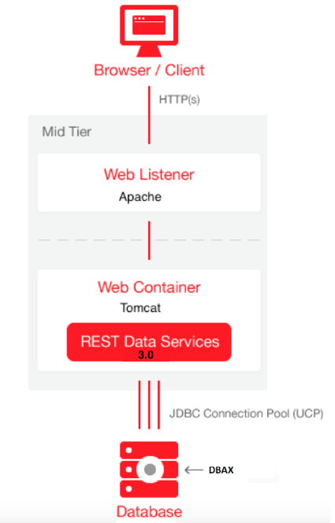

<b>Arquitectura DABX</b>

EL motor de DBAX reside en una Base de Datos Oracle. Por ello, los navegadores web mediante las peticiones HTTP deben llegar de alguna forma al motor de DBAX. 

Existen varias arquitecturas que se pueden emplear para usar DBAX que deberemos elegir en función de nuestras necesidades. Por ejemplo, dependiendo el entorno (desarrollo o producción) en el que estemos, si estamos programando en nuestro ordenador en local o por el contrario lo quremos hacer sobre un entorno en remoto de desarrollo, o incluso si ya tenemos middleware antiguo que queramos reutilizar y no tener así que configurar nada nuevo. 

DBAX sigue la misma arquitectura que Oracle APEX, por tanto 

##Entorno Producción

El siguiente gráfico muestra la arquitectura de DBAX en un entorno de producción, haciendo uso de Oracle Rest Data Services (ORDS). 

Oracle REST Data Services (formerly APEX Listener) - The Oracle REST Data Services (ORDS) is Java based, can be installed into any J2EE compliant Web Server, and is the preferred option for use with Oracle Application Express. It is a free tool that is fully supported against Oracle WebLogic Server, Oracle Glassfish Server, and Apache Tomcat. Oracle REST Data Services is part of the reference architecture used to operate the Oracle Database Cloud Service.

Nota: modificar la imagen y poner que los recursos los debe servir un el apache.

##Entorno Desarrollo local
Para un entorno de desarrollo, preferiblemente local, es muy util el uso de DBMS_EPG (Embedded PL/SQL Gateway).
Embedded PL/SQL Gateway - The Embedded PL/SQL Gateway (EPG) runs in the Oracle XML DB Protocal Server within the Oracle database and includes the core features of mod_plsql. Licensing for the Embedded PL/SQL Gateway is included with the Oracle Database license

##Reaprovechando su middleware antiguo
Oralce HTTP Server o Oracle IAS

Si en su empresa ya dispone de un Servidor web Oacle HTTP Servero o los antiguos Oracle IAS que disponene de `mod_plsql` puede continuar usandolos con total compatibilidad. 

HTTP Server - The Oracle HTTP Server (Apache) with mod_plsql plugin can be placed on the same physical machine as the database, or on a separate physical machine.
Note: If installed on the same physical machine as the database then the Oracle HTTP Server is included as part of the limited-use license included with the Oracle Database license - otherwise the Oracle HTTP Server will need to be licensed.
Warning: mod_plsql is deprecated as of Oracle HTTP Server 12c (12.1.3). For more information, please see My Oracle Support Note 1576588.1. Oracle recommends using Oracle REST Data Services instead..

##Tabla comparativa de Gateways para DABX

Capabilities

Oracle REST Data Services

Embedded PL/SQL Gateway

Oracle HTTP Server

Image location File system Within database File system 
Configuration options GUI Interface (Release >= 2.0); Administration pages Database initialization parameters Database Access Descriptor (DAD) 
Connection Pool settings JDBC connection parameters SHARED_SERVERS; MAX_SHARED_SERVERS Min/MaxSpareServers; MaxClients 
Emit RESTful Web Services Yes (Release >= 2.0) No No 
Support multi-databases Yes, including RAC No Yes, including RAC 
Virus scan files Yes, with integration of ICAP server No No 
PDF printing Yes, included FOP support (Release >= 2.0) No No 
Environment recommendations All Development only All 

 
