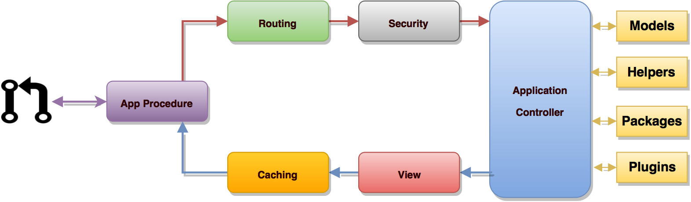

<b>Diagrama del flujo de una aplicación</b>

##Diagrama de flujo

El siguiente gráfico ilustra cómo es el flujo de datos el sistema:

1 - El servidor web elegido manda la petición del usuario a un procedimiento que tiene el APPID como nombre. Éste invoca a DBAX_CORE que hace de controlador frontal e inicializa de los recursos básicos necesarios para ejecutar DBAX.
2 - El enrutador examina la petición HTTP para determinar qué se debe hacer con ella.
3 - Si existe un archivo de caché, se envía directamente al navegador, sin pasar por la ejecución normal del sistema.
4 - Seguridad. Antes de que se cargue el controlador de la aplicación, la petición HTTP y todos los datos enviados por los usuarios se analizan por seguridad.
5 - El controlador carga el modelo, revisa la autorización, recupera los parámetros del usuario, y todos los demás recursos necesarios para procesar la solicitud.
6 - La vista final se prestan, entonces se envía al navegador web para ser visualizada. Si se habilita el almacenamiento en caché, la vista se almacena en la caché primero, para que en las solicitudes posteriores se puede servir directamente desde la caché.
