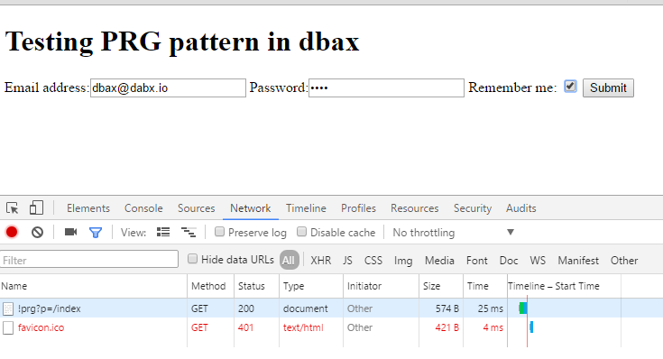
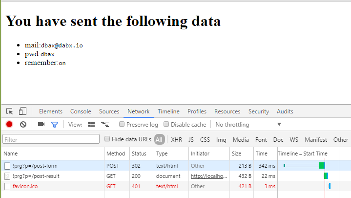

Patrón PRG en **dbax**
========================

Como indica la Wikipedia, Post/Redirect/Get (PRG), también conocido como Redirect After Post, es un patrón de diseño de desarrollo web que impide algunos envíos de formularios duplicados, creando una interfaz más intuitiva para los agentes de usuario (usuarios). PRG implementa marcadores y el botón Actualizar de un modo predecible que no crea envíos de formularios duplicados.

A continuación se muestra como implementar este patrón en **dbax** guardando los valores introducidos en el formulario en la sesión del usuario para poder mostrarlos posteriormente en la página GET.

Esto es útil cuando se envía un formulario y queremos mostrar algun mensaje de confirmació o error en función de los datos introducidos.

##Aplicación
Para hacer esta guía he creado una aplicación nueva vacía, en ella crearemos las rutas y las vistas para implementar el ejemplo del patrón PRG y finalmente haremos nuestros controladores. 

##Rutas
Creamos las rutas para las URLs. 

| Route Name | URL Pattern | Controller Method |
| -- | -- | --|
index_ | NULL | pk_c_dbax_PRG.index_ |
index| index |  pk_c_dbax_PRG.index_ |
post_form | post-form |pk_c_dbax_prg.post_form |
post_result | post-result | pk_c_dbax_prg.post_result|


La ruta `index` tendrá el formulario. 
La ruta `post_form` será la que reciba el POST del formulario
La ruta `post_result` será la ruta a la que redireccionaremos tras el POST y donde se mostrarán los datos del formulario.

##Views

###Index

```html
<!DOCTYPE html>
<html>
   <head>
      <title>${title} - PRG</title>
   </head>
   <body>
      <h1>Testing PRG pattern in <strong>dbax</strong></h1>
      <form method="POST" action="${base_path}/post-form">
         Email address:<input type="email"name="email">
         Password:<input type="password" name="pwd">
         Remember me: <input type="checkbox" name="remember">
         <button type="submit">Submit</button>
      </form>
   </body>
</html>
```

###post-result

```html
<!DOCTYPE html>
<html>
   <head>
      <title>${title} - PRG</title>
   </head>
   <body>
      <h1>You have sent the following data</h1>
      <ul>
         <li>mail:<code>${email}</code></li>
         <li>pwd:<code>${pwd}</code></li>
         <li>remember:<code>${remember}</code></li>
      </ul>
   </body>
</html>
```

##Coontrollers

```sql
CREATE OR REPLACE PACKAGE pk_c_dbax_prg
AS
   PROCEDURE index_;

   PROCEDURE post_form;

   PROCEDURE post_result;
END pk_c_dbax_prg;
/

CREATE OR REPLACE PACKAGE BODY pk_c_dbax_prg
AS
   PROCEDURE index_
   AS
   BEGIN
      --Index view with form
      dbax_core.load_view ('index');
   END index_;

   PROCEDURE post_form
   AS
      l_session   VARCHAR2 (300);
   BEGIN
      IF dbax_core.g$server ('REQUEST_METHOD') = 'POST'
      THEN
         --Start new session if not exists
         IF dbax_session.get_session IS NULL
         THEN
            dbax_session.session_start;
         END IF;
         
         /**
         * Do your bussines logic here with POST data         
         */
         /*...*/

         --Save POST data into session variables
         dbax_session.g$session ('email') := dbax_utils.get (dbax_core.g$post, 'email');
         dbax_session.g$session ('pwd') := dbax_utils.get (dbax_core.g$post, 'pwd');
         dbax_session.g$session ('remember') := dbax_utils.get (dbax_core.g$post, 'remember');

         -- Redirect user to result page
         dbax_core.g$status_line := 303;
         dbax_core.g$http_header ('Location') := dbax_core.get_path ('/post-result');
      ELSE
         -- Redirect user to index, Not HTTP GET method
         dbax_core.g$status_line := 303;
         dbax_core.g$http_header ('Location') := dbax_core.get_path ('/index');
      END IF;
   END post_form;

   PROCEDURE post_result
   AS
      l_session   VARCHAR2 (300);
   BEGIN
      --Get session id. This load session variables. 
      l_session   := dbax_session.get_session;
      
      --Load session variables into view variables. 
      dbax_core.g$view ('email') := dbax_utils.get (dbax_session.g$session, 'email');
      dbax_core.g$view ('pwd') := dbax_utils.get (dbax_session.g$session, 'pwd');
      dbax_core.g$view ('remember') := dbax_utils.get (dbax_session.g$session, 'remember');

      dbax_core.load_view ('post-result');

      --Delete this session variables.
      dbax_session.g$session.delete ('email');
      dbax_session.g$session.delete ('pwd');
      dbax_session.g$session.delete ('remember');
   END post_result;
END pk_c_dbax_prg;
/
```

##Result
###index page

###post-result page
